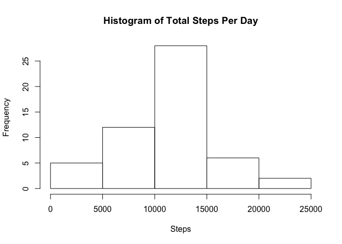
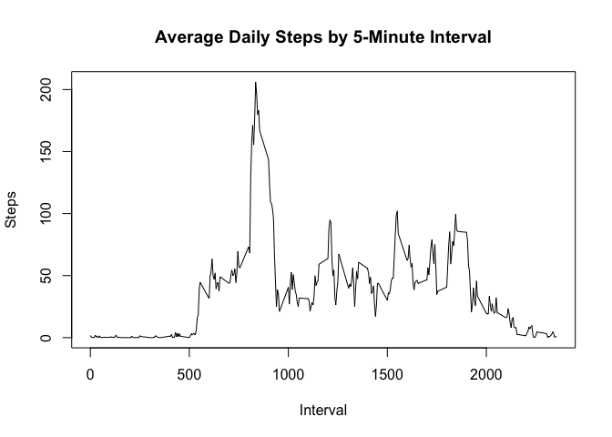
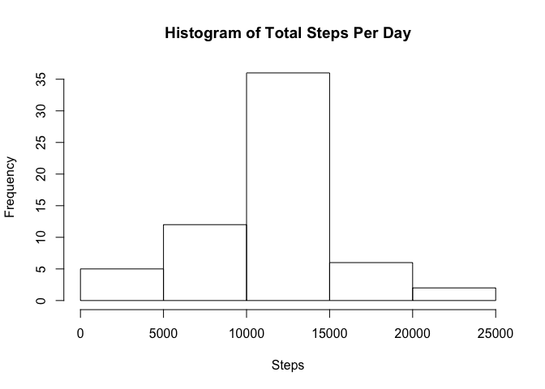
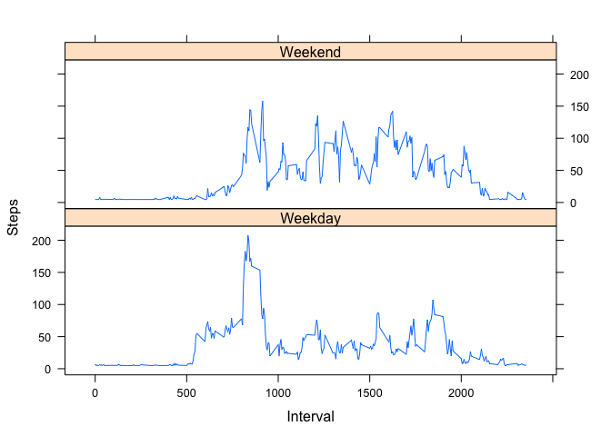

## Loading and preprocessing the data

```r
#### Load libraries
library(tidyverse)
library(data.table)
library(here)

#### Load activity data
unzip('activity.zip', exdir = 'ext')
data <- fread(here('ext','activity.csv'))

#### Format date column
data$date <- as.Date(data$date, "%Y-%m-%d")
```

## What is mean total number of steps taken per day?
#### 1. Calculate the total number of steps taken per day

```r
# For this part of the assignment, you can ignore the missing values in the dataset.
dsub <- data %>%
        group_by(date) %>%
        summarise(steps = sum(steps)) %>%
        na.omit()
print(dsub)
```

```
## # A tibble: 53 x 2
##    date       steps
##    <date>     <int>
##  1 2012-10-02   126
##  2 2012-10-03 11352
##  3 2012-10-04 12116
##  4 2012-10-05 13294
##  5 2012-10-06 15420
##  6 2012-10-07 11015
##  7 2012-10-09 12811
##  8 2012-10-10  9900
##  9 2012-10-11 10304
## 10 2012-10-12 17382
## # … with 43 more rows
```

#### 2. Make a histogram of the total number of steps taken each day

```r
hist(dsub$steps,
     xlab = "Steps",
     main = "Histogram of Total Steps Per Day")
```



#### 3. Calculate and report the mean and median of the total number of steps taken per day

```r
meanSteps <- prettyNum(round(mean(dsub$steps)), big.mark = ",")
medianSteps <- prettyNum(round(median(dsub$steps)), big.mark = ",")
```
* The **average (mean)** number of steps taken each day is **10,766**
* The **median** number of steps taken each day is **10,765**

### What is the average daily activity pattern?
#### 1. Make a time series plot of the 5-minute interval (x-axis) and the average number of steps taken, averaged across all days

```r
dsub2 <- data  %>%
        group_by(interval) %>%
        summarise(
                steps = mean(steps, na.rm = TRUE)
        )
dsub2 %>% plot(type = "l", xlab = "Interval", ylab = "Steps", main = "Average Daily Steps by 5-Minute Interval")
```



#### 2. Which 5-minute interval, on average across all the days in the dataset, contains the maximum number of steps?

```r
maxSteps <-  prettyNum(round(max(dsub2$steps)), big.mark = ",")
intMaxSteps <- dsub2$interval[dsub2$steps == max(dsub2$steps)]
```
* The maximum average number of steps taken across all days in the data set is **206**, found in at the **835th** interval

## Imputing missing values
Note that there are a number of days/intervals where there are missing values (coded as NA). The presence of missing days may introduce bias into some calculations or summaries of the data.

#### 1. Calculate and report the total number of missing values in the dataset (i.e. the total number of rows NAs)


```r
ttlNa <- nrow(data[is.na(steps) == TRUE]) %>% prettyNum(big.mark = ",")
```

* The total number of missing values in the data set is **2,304**

#### 2. Devise a strategy for filling in all of the missing values in the dataset. The strategy does not need to be sophisticated.

```r
# For example, you could use the mean/median for that day, or the mean for that 5-minute interval, etc.
library(Hmisc)
dsub3 <- data %>% mutate(
        imputed = impute(steps, mean)
)
```
* Missing data were imputed using the Hmisc package and based on the average (mean) steps taken by day and interval

#### 3. Create a new dataset that is equal to the original dataset but with the missing data filled in.

```r
dsub3 <- dsub3 %>% select(4,2,3) %>% rename(steps = imputed) %>% as_tibble()
print(dsub3)
```

```
## # A tibble: 17,568 x 3
##    steps    date       interval
##    <impute> <date>        <int>
##  1 37.3826  2012-10-01        0
##  2 37.3826  2012-10-01        5
##  3 37.3826  2012-10-01       10
##  4 37.3826  2012-10-01       15
##  5 37.3826  2012-10-01       20
##  6 37.3826  2012-10-01       25
##  7 37.3826  2012-10-01       30
##  8 37.3826  2012-10-01       35
##  9 37.3826  2012-10-01       40
## 10 37.3826  2012-10-01       45
## # … with 17,558 more rows
```

#### 4. Make a histogram of the total number of steps taken each day and Calculate and report the mean and median total number of steps taken per day. Do these values differ from the estimates from the first part of the assignment? What is the impact of imputing missing data on the estimates of the total daily number of steps?


```r
dsub4 <- dsub3 %>%
        group_by(date) %>%
        summarise(steps = sum(steps))
hist(dsub4$steps,
     xlab = "Steps",
     main = "Histogram of Total Steps Per Day")
```




```r
# Calculate and report the mean and median total number of steps taken per day. Do these values differ from the estimates from the first part of the assignment? What is the impact of imputing missing data on the estimates of the total daily number of steps?
impMeanSteps <-  prettyNum(round(mean(dsub4$steps)), big.mark = ",")
impMedianSteps <- prettyNum(round(median(dsub4$steps)), big.mark = ",")
medDiff <- round(median(dsub4$steps) - median(dsub$steps),2)
```
* The mean and median total steps taken per day are **10,766**. The effect of imputing missing data has slightly increased the median total steps per day by **1.19** as compared to original estimates.

## Are there differences in activity patterns between weekdays and weekends?
#### 1. Create a new factor variable in the dataset with two levels – “weekday” and “weekend” indicating whether a given date is a weekday or weekend day.


```r
# For this part the weekdays() function may be of some help here. Use the dataset with the filled-in missing values for this part.
`%!in%` <- Negate(`%in%`)
dsub5 <- dsub3 %>% mutate(
        dtype = case_when(
                weekdays(date) %in% c("Saturday", "Sunday") ~ "Weekend",
                weekdays(date) %!in% c("Saturday", "Sunday") ~ "Weekday"
        )
) %>%
        group_by(dtype, interval) %>%
        summarise(steps = mean(steps)) %>% as_tibble()
print(dsub5)
```

```
## # A tibble: 576 x 3
##    dtype   interval steps
##    <chr>      <int> <dbl>
##  1 Weekday        0  7.01
##  2 Weekday        5  5.38
##  3 Weekday       10  5.14
##  4 Weekday       15  5.16
##  5 Weekday       20  5.07
##  6 Weekday       25  6.30
##  7 Weekday       30  5.61
##  8 Weekday       35  6.01
##  9 Weekday       40  4.98
## 10 Weekday       45  6.58
## # … with 566 more rows
```

#### 2. Make a panel plot containing a time series plot (i.e. type="l") of the 5-minute interval (x-axis) and the average number of steps taken, averaged across all weekday days or weekend days (y-axis).


```r
# See the README file in the GitHub repository to see an example of what this plot should look like using simulated data.
library(lattice)
xyplot(steps ~ interval | dtype, data = dsub5, type = "l", layout = c(1, 2), xlab = "Interval", ylab = "Steps")
```


